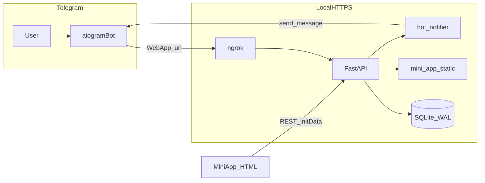

# План: демо бот + Mini App + API (обновлённая версия)

## Контекст репозитория

Рабочая область **пустая** — реализация с нуля. Файла `.cursorrules` в проекте нет; ориентир — ТЗ (async, type hints, docstrings на русском, `.env`, логирование).

## Целевая архитектура

- **FastAPI** (порт 8000): REST `/api/*`, `GET /api/health`, раздача `mini_app/`, статика `data/photos/` как `/static/photos/...`.
- **Бот** (`main.py`): отдельный процесс, общий модуль БД с API.
- **Уведомления**: не размазывать вызовы `Bot` по роутам — общий слой [`utils/notifications.py`](utils/notifications.py) (контракт: «что отправить») и [`utils/bot_notifier.py`](utils/bot_notifier.py) (создание `Bot`, `session`, `send_message` / закрытие сессии). Эндпоинты вызывают только сервис уведомлений.

## Структура каталогов (уточнённая)

Корень workspace = корень приложения (эквивалент `demo_melody/` из ТЗ).

- [`main.py`](main.py) — точка входа бота: `asyncio.run`, polling, подключение роутеров из `bot.handlers`.
- [`config.py`](config.py) — `pydantic-settings`: обязательные поля (`bot_token`, `database_url`, `secret_key`, `admin_ids`, `webapp_url` как URL), парсинг `ADMIN_IDS` в `list[int]`, опционально `log_level`, `sql_echo: bool`.
- [`database.py`](database.py) — async engine/session factory, модели `User`, `MasterClass`, `Booking`.
- [`keyboards.py`](keyboards.py) или [`bot/keyboards.py`](bot/keyboards.py) — inline/WebApp клавиатуры (решение при реализации: один модуль рядом с хендлерами).
- [`bot/filters.py`](bot/filters.py) — фильтры (например `AdminFilter`).
- [`bot/middlewares.py`](bot/middlewares.py) — логирование входящих апдейтов, перехват ошибок.
- [`bot/handlers/`](bot/handlers/) — `start`, `categories`, `masterclasses`, `my_bookings`, `admin` (+ `__init__.py` для сборки роутера).
- [`api/main.py`](api/main.py) — приложение FastAPI: роутеры, middleware, exception handlers, монтирование статики.
- [`api/deps.py`](api/deps.py) — зависимости: `AsyncSession`, опционально проверка заголовка для внутренних вызовов.
- [`api/schemas.py`](api/schemas.py) — Pydantic-схемы запросов/ответов с примерами (`model_config` / `json_schema_extra`).
- [`api/exceptions.py`](api/exceptions.py) — кастомные исключения домена (например `BookingConflictError`).
- [`api/middleware.py`](api/middleware.py) — корреляция запросов, простой **rate limit** (in-memory по IP для `POST /api/bookings`), при необходимости общий обработчик таймаутов.
- [`api/routes/masterclasses.py`](api/routes/masterclasses.py), [`api/routes/bookings.py`](api/routes/bookings.py) — эндпоинты; везде `tags`, `summary`, `responses` для Swagger.
- [`mini_app/`](mini_app/) — как в ТЗ: `index.html`, `css/style.css`, `js/app.js`, `js/api.js`.
- [`utils/logger.py`](utils/logger.py) — единая настройка `logging`: уровни для `uvicorn`, `sqlalchemy`, `aiogram`; опционально JSON-формат через env; `echo` SQL только при отладке.
- [`utils/notifications.py`](utils/notifications.py) + [`utils/bot_notifier.py`](utils/bot_notifier.py) — уведомления и реализация через aiogram; **напоминание за 24 ч** — заглушка с записью в лог.
- [`tests/test_api.py`](tests/test_api.py), [`tests/test_db.py`](tests/test_db.py) — базовые тесты (см. ниже).
- [`alembic/`](alembic/) — **опционально** для демо; допустимо `create_all` + сид Python.
- [`data/demo_data.sql`](data/demo_data.sql), [`data/photos/`](data/photos/) — SQL/картинки для демо.
- [`.env.example`](.env.example), [`requirements.txt`](requirements.txt), [`run.bat`](run.bat), [`README.md`](README.md), [`LICENSE`](LICENSE) (MIT).

**Согласование с исходным ТЗ:** папка `bot_handlers/` из ТЗ заменяется на **`bot/handlers/`** для ясной иерархии (`filters`, `middlewares`, handlers в одном пакете `bot`).

## База данных и целостность

- **Unique constraint:** `UNIQUE(user_id, master_class_id)` на `bookings` (одна активная бронь на пользователя на МК; при отмене — смена `status`, повторная запись — по бизнес-правилу либо запрет через partial index; для демо достаточно unique + обработка `IntegrityError` в API).
- **Cascade:** при удалении `MasterClass` — каскадное удаление связанных `Booking` (`ondelete="CASCADE"`). Связь `User` — `bookings` с поведением, не ломающим демо (`CASCADE` или `RESTRICT` — зафиксировать в коде и в плане: предпочтительно `CASCADE` от МК к броням, от пользователя к броням — `CASCADE` для демо-чистки данных).
- **SQLite:** при создании движка включить **WAL** (`PRAGMA journal_mode=WAL`) для меньшего риска блокировок при двух процессах (бот + API).

## День 1: Бот + БД + API

1. **Зависимости:** `aiogram>=3`, `fastapi`, `uvicorn[standard]`, `sqlalchemy[asyncio]`, `aiosqlite`, `pydantic-settings`, `python-multipart`, `httpx`, `pytest`, `pytest-asyncio`; **опционально** `alembic`. Примечание: Swagger/OpenAPI встроен в FastAPI — отдельный `fastapi-cli` не требуется.
2. **Каркас API:** глобальные exception handlers (HTTPException, ValidationError, доменные ошибки), `GET /api/health` (статус + проверка соединения с БД).
3. **Эндпоинты:** как в ТЗ + обёртка уведомлений после успешного `POST /api/bookings`.
4. **Бот:** `/start`, категории, список МК с фото, WebApp, «Мои записи».
5. **Сид:** 3–5 мастер-классов, даты **2026+**.

## День 2: Mini App + интеграция + безопасность

1. **Mini App:** mobile-first; `API_BASE = window.location.origin`; состояния **loading** на кнопке подтверждения; **сообщения об ошибках** пользователю; **retry** 1–2 раза при сетевых ошибках/`fetch` reject.
2. **Дата в UI:** как в базовом плане — одна `date_time` на МК; dropdown/кнопки с одним слотом допустимы для соответствия ТЗ.
3. **initData:** не полагаться только на `initDataUnsafe`; на бэкенде для `POST /api/bookings` передавать сырой `initData` строкой и проверять **HMAC-подпись** по документации Telegram (используя `BOT_TOKEN`). При невалидной подписи — `401` с понятным телом. Для локальной отладки — флаг env `SKIP_INIT_DATA_VALIDATION=true` (по умолчанию false; явно описать в README).
4. **CORS:** `CORSMiddleware` с origin из `WEBAPP_URL` / ngrok-хоста (или узкий список) — устранить типичные CORS-ошибки при отладке.
5. **Rate limiting:** простой счётчик по IP (asyncio lock + dict) на `POST /api/bookings` — защита от случайного спама в демо.
6. **Админка:** `/admin`, FSM **MemoryStorage**, ввод МК, фото — URL.

## День 3 (по возможности)

**Nice to have:** отмена брони из «Мои записи»; статистика для админа; поиск/фильтр по названию и дате; QR — только если останется время. Полировка CSS, скринкаст, резервный сценарий с видео/скриншотами.

## Приоритеты

- **Must (день 1–2):** бот с меню, CRUD/чтение API для МК и броней, Mini App с формой, запись в БД, уведомление в чат, сид, health, базовые тесты API.
- **Should (день 2–3):** админка, «Мои записи», обработка ошибок (API + Mini App), Swagger-описания, CORS + initData + rate limit, README с troubleshooting.
- **Nice:** отмена брони, статистика, поиск/фильтры, QR.

## Сценарии для клиента (чеклист в README)

**Сценарий 1 — запись на МК**

1. `/start` — главное меню.
2. «Расписание» — три категории.
3. Категория (например «Кулинария») — список МК.
4. Выбор МК — фото, описание, цена, дата.
5. «Записаться» — открытие WebApp.
6. Заполнение имени/телефона — «Подтвердить».
7. Сообщение в чат: «Вы записаны!».
8. «Мои записи» — бронь отображается.

**Сценарий 2 — админ**

1. `/admin` (только `ADMIN_IDS`).
2. «Добавить мастер-класс» — пошаговый ввод.
3. Проверка появления в расписании.

## Чеклист перед демо (кратко)

- Даты МК **2026+**, фото аккуратные, нет ошибок в консоли браузера.
- Проверка на **реальном телефоне**, не только Desktop.
- `WEBAPP_URL` совпадает с текущим https ngrok; `.env` не в git.
- Отклик API заметно быстрый; при сбое ngrok — **скринкаст или скриншоты** как запасной план.

## Улучшенный run.bat (логика)

- Запуск `uvicorn` для `api.main:app` в отдельном окне (`cmd /k`).
- Пауза `timeout` 2–3 с.
- Запуск `ngrok http 8000` во втором окне.
- Вывод в консоль: скопировать URL в `WEBAPP_URL`, затем в третьем окне/вручную `python main.py`.

## Тестирование (минимум)

- `tests/test_api.py`: `GET /api/health` = 200; `POST /api/bookings` создаёт запись (с валидной подписью initData **или** с тестовым обходом через `SKIP_INIT_DATA_VALIDATION` только в pytest).
- `tests/test_db.py` или интеграционный тест: нарушение unique `(user_id, master_class_id)` даёт ожидаемую ошибку API/БД.

## Риски и решения

| Риск | Решение |
|------|---------|
| Mini App без HTTPS | ngrok / localtunnel; в README запасной вариант |
| ngrok меняет URL | Обновлять `.env`, не коммитить секреты |
| SQLite locking | WAL + короткие транзакции |
| CORS | Явные origins в middleware |
| initData не приходит / WebApp | Открывать из **message** с WebApp-кнопкой, проверка в JS `Telegram.WebApp.initData` |
| Дублирование броней | Unique в БД + обработка в сервисе |
| Сложность вызова Bot из FastAPI | Изолировать в `bot_notifier.py`, один входной метод `notify_booking_created` |

## Документы

- `README.md`: установка, порядок запуска, ngrok, FAQ, troubleshooting (CORS, initData, не тот URL), сценарии выше, чеклист перед демо.
- `LICENSE` MIT — по согласованию с владельцем демо (клиентское демо).
