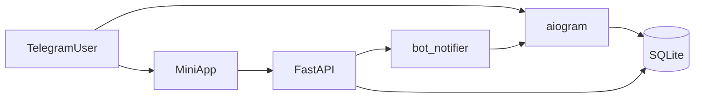

# Демо: Telegram-бот записи на мастер-классы с Mini App

Краткое описание: демонстрационный проект для клиента — бот на **aiogram 3**, Mini App (HTML/CSS/JS), backend на **FastAPI**, база **SQLite** (async SQLAlchemy). Полный цикл: расписание по категориям, карточка мастер-класса, запись через WebApp, уведомление в чат, «Мои записи» с отменой, админ-панель для добавления мастер-класса.

## Скриншоты / демо

Плейсхолдер: после запуска приложите скриншоты сценариев из раздела «Сценарий для клиента» или запишите короткий скринкаст.

## Установка и запуск

### Запуск через окно мастера (Windows)

1. Установите зависимости в виртуальное окружение (см. шаги ниже).
2. Дважды щёлкните `[launch_gui.bat](launch_gui.bat)` или выполните `python launch_gui.py` из корня проекта.
3. Введите **BOT_TOKEN**, **SECRET_KEY**, **WEBAPP_URL**, **ADMIN_IDS** (и при необходимости остальные поля), нажмите **«Сохранить .env»**.
4. **«Запустить API»** — откроется отдельное окно консоли с uvicorn (порт 8000); перед запуском текущие значения полей **автоматически записываются** в `.env`.
5. **«Запустить ngrok»** — отдельное окно; скопируйте выданный **https**-URL в поле **WEBAPP_URL** и снова нажмите **«Сохранить .env»** (иначе Mini App и CORS не совпадут с туннелем).
6. **«Запустить бота»** — отдельное окно с `python main.py` (также с автосохранением `.env` из полей).

Кнопка **«Сохранить и запустить API»** объединяет шаги 3–4. Полный URL туннеля по-прежнему нужно подставить после ngrok вручную.

### Требования

- Python 3.11+
- Аккаунт [BotFather](https://t.me/BotFather) и токен бота
- [ngrok](https://ngrok.com/) (или другой HTTPS-туннель) для Mini App

### Шаги

1. Клонируйте/скопируйте проект, создайте виртуальное окружение и установите зависимости:

```bash
python -m venv .venv
.venv\Scripts\activate
pip install -r requirements.txt
```

1. Скопируйте `[.env.example](.env.example)` в `.env` и заполните:

- `BOT_TOKEN` — токен бота
- `WEBAPP_URL` — **https**-URL на ваш туннель до порта 8000 (например `https://xxxx.ngrok-free.app` без завершающего `/`)
- `ADMIN_IDS` — ваш числовой Telegram user id (через запятую, если несколько)
- `SECRET_KEY` — произвольная строка для демо

1. Запустите API (из корня проекта):

```bash
python -m uvicorn api.main:app --host 0.0.0.0 --port 8000 --reload
```

1. Запустите туннель:

```bash
ngrok http 8000
```

1. Пропишите выданный **https**-адрес в `WEBAPP_URL` в `.env`.
2. Запустите бота (второй терминал):

```bash
python main.py
```

На Windows можно использовать `[run.bat](run.bat)`: откроются окна API и ngrok; затем вручную выполните шаг 5–6.

### Тесты

```bash
python -m pytest tests -q
```

## Документация

- **Swagger / OpenAPI**: после запуска API откройте [http://localhost:8000/docs](http://localhost:8000/docs)
- **Безопасность демо**: проверка подписи `initData` Telegram на `POST /api/bookings`; для локальной отладки есть `SKIP_INIT_DATA_VALIDATION=true` (не включайте в продакшене). Добавлены CORS и простой rate limit.

### Категории безопасности

- Не публикуйте `.env` и токен бота.
- `WEBAPP_URL` должен совпадать с доменом, с которого открывается Mini App (обычно домен ngrok).

## Архитектура проекта

- `[main.py](main.py)` — polling Telegram-бота
- `[api/main.py](api/main.py)` — FastAPI: REST `/api/`*, раздача `[mini_app/](mini_app/)` и статики фото
- `[database.py](database.py)` — модели и инициализация SQLite (WAL, сид демо-данных)
- `[bot/handlers/](bot/handlers/)` — хендлеры: старт, расписание, мастер-классы, мои записи, админка (FSM)
- `[utils/](utils/)` — логирование, уведомления, проверка WebApp, отправка сообщений ботом из API




## Сценарий для клиента

### Сценарий 1: запись на мастер-класс

1. `/start` — главное меню
2. «Расписание» — три категории
3. Выбор категории — список мастер-классов
4. Выбор мастер-класса — фото, описание, цена, дата
5. «Записаться» — открывается Mini App
6. Заполнить имя и телефон — «Подтвердить бронь»
7. В чат приходит сообщение «Вы записаны!»
8. «Мои записи» — отображается бронь; при необходимости — «Отменить»

### Демо для клиента без вашего Telegram ID

На тестовом деплое (например Render) задайте **`DEMO_MODE=true`**. Тогда у **любого** пользователя в меню появятся `/start` и `/admin`, и админ-панель откроется без проверки `ADMIN_IDS`. **На боевом боте обязательно `DEMO_MODE=false`**, иначе любой сможет менять расписание.

### Сценарий 2: админ

1. Откройте `/admin` (см. меню и блок «Демо для клиента» выше).
2. «Добавить мастер-класс» — пошаговый ввод полей.
3. Проверить появление в расписании.

## Troubleshooting / FAQ


| Проблема                                      | Что проверить                                                                                                                                                                                       |
| --------------------------------------------- | --------------------------------------------------------------------------------------------------------------------------------------------------------------------------------------------------- |
| Mini App не открывается                       | `WEBAPP_URL` должен быть **https** и совпадать с URL в ngrok                                                                                                                                        |
| CORS в браузере                               | Домен Mini App должен быть в `WEBAPP_URL` или `CORS_ORIGINS`                                                                                                                                        |
| 401 при брони                                 | Валидный `initData` только внутри Telegram; для отладки — `SKIP_INIT_DATA_VALIDATION=true`                                                                                                          |
| Фото не грузится в Telegram                   | Убедитесь, что URL фото публичный (`https://.../static/photos/...`)                                                                                                                                 |
| ngrok меняет URL                              | Обновите `WEBAPP_URL` в `.env` и перезапустите бота                                                                                                                                                 |
| Окно ngrok сразу закрывается                  | Выполните `ngrok config add-authtoken …` (токен в [дашборде ngrok](https://dashboard.ngrok.com/)); проверьте, что `ngrok` в PATH. Окно из мастера запускается через `cmd /k`, текст ошибки остаётся |
| `NoSuchModuleError: ...:https` при старте API | В `DATABASE_URL` случайно указан https-адрес. Оставьте `sqlite+aiosqlite:///./demo.db`, а ngrok — только в `WEBAPP_URL`                                                                             |
| `Conflict: terminated by other getUpdates`    | С **одним токеном** одновременно работает только **один** polling: остановите бота на ПК (`launch_gui` / `python main.py`), второй Render-сервис или старый деплой. Оставьте только один процесс с `getUpdates`. |


## Чеклист перед демо

- Даты мастер-классов в **2026** году (сид в `[database.py](database.py)`)
- Нет ошибок в консоли браузера Mini App
- Проверка на **телефоне** в Telegram
- Запасной план: скринкаст или скриншоты, если туннель недоступен

## Лицензия

См. [LICENSE](LICENSE).

## Контакты разработчика

**Вова | pycraft-dev**  
Python-разработчик • Современные GUI-приложения • Автоматизация

📧 [pycraft-dev@21051992.ru](mailto:pycraft-dev@21051992.ru)  
💬 Telegram: [@Pycraftdev](https://t.me/Pycraftdev)  
💼 [Kwork](https://kwork.ru/user/pycraft-dev)  
🐙 [GitHub](https://github.com/pycraft-dev)

> Нужно похожее решение под ваши задачи? Напишите — обсудим.

